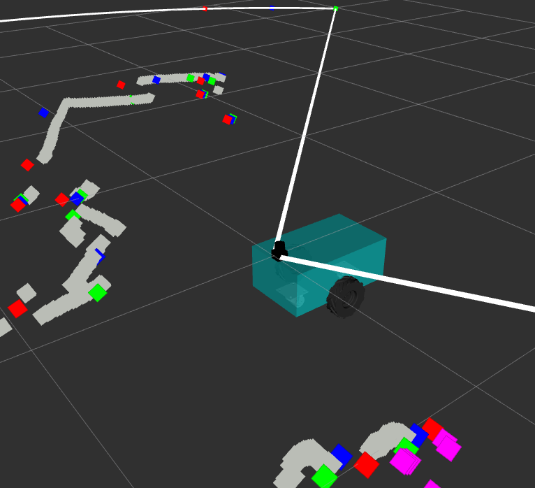

# RobAir_Updated_2022
Introduction to Robotics Labs
[Course Link](https://lig-membres.imag.fr/aycard/html/Enseignement/M1/Robotics/index.html)



---

## Requirements

1. [ROS1](http://wiki.ros.org/noetic/Installation/Ubuntu).
2. [CMake](https://cmake.org/) Version >= 3.9.1.


## How it works

Considering that you have Ros1:

```
mkdir -p robair_ws/src && cd robair_ws
git clone https://github.com/bhomaidan1990/RobAir_Updated_2022.git src/
# install dependencies
rosdep install --from-paths src --ignore-src -r -y
catkin init
catkin config -DCMAKE_BUILD_TYPE=RELEASE
catkin b
```
Then:

### Lab 1

```
. devel/setup.bash
roslaunch tutorial_ros robair_lab1.launch
```

### Lab 2

```
. devel/setup.bash
roslaunch follow_me robair_lab2.launch
```

### Lab 3

```
. devel/setup.bash
roslaunch localization robair_lab3.launch
```
### Gazebo Simulation
```
. devel/setup.bash
roslaunch robair_gazebo robair_gazebo.launch
```

## Known Bugs:

> Robot Control
- Robot Controller is not working well yet!

> Robot Description
- Collision mode is not checked with accurate measurements.
- Robot Wheels are different from actual!

> Robot Hardware Interface
- Is not working well yet!
